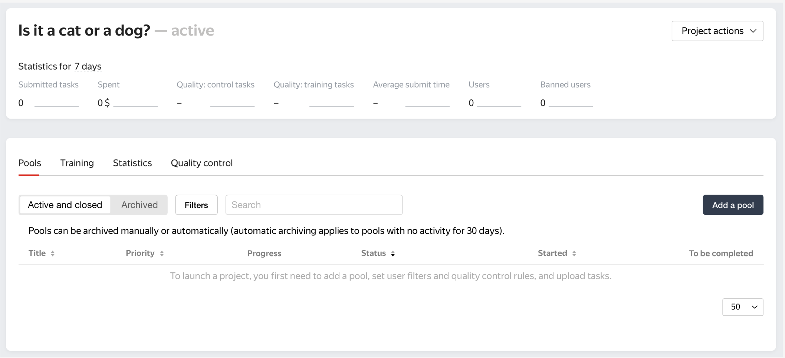
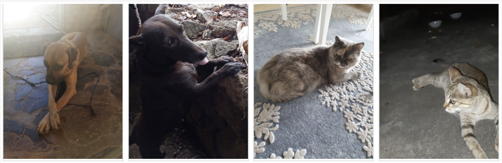

# Image binary classification

To run code below use [class ImageClassification](../../src/main/java/examples/ImageClassification.java).


To get acquainted with Toloka tools for free, you can use the promo code **TOLOKAKIT1** on $20 on your 
[profile page](https://toloka.yandex.com/requester/profile?utm_source=github&utm_medium=site&utm_campaign=tolokakit) 
after registration.

Сreate toloka-client factory instance. All api calls will go through it.

```java
var clientFactory = new TolokaClientFactoryImpl(DefaultHttpClientConfiguration.DEFAULT_TOLOKA_PROD_URI,
                                                "Your token here");
```

Switch `DefaultHttpClientConfiguration.DEFAULT_TOLOKA_PROD_URI` to `DefaultHttpClientConfiguration.DEFAULT_TOLOKA_SANDBOX_URI`
to use [Sandbox](https://toloka.ai/docs/guide/concepts/sandbox.html?lang=en).

## Creating new project

Define name and description of project.

```java
String name = "Is it a cat or a dog?";
String description = "Look at the picture and decide whether there is a cat or a dog.";
```
Create task interface.

```java 
String config = "{\n" +
        "  \"view\": {\n" +
        "    \"items\": [\n" +
        "      {\n" +
        "        \"url\": {\n" +
        "          \"path\": \"image\",\n" +
        "          \"type\": \"data.input\"\n" +
        "        },\n" +
        "        \"ratio\": [\n" +
        "          1,\n" +
        "          1\n" +
        "        ],\n" +
        "        \"rotatable\": true,\n" +
        "        \"type\": \"view.image\"\n" +
        "      },\n" +
        "      {\n" +
        "        \"data\": {\n" +
        "          \"path\": \"result\",\n" +
        "          \"type\": \"data.output\"\n" +
        "        },\n" +
        "        \"options\": [\n" +
        "          {\n" +
        "            \"value\": \"cat\",\n" +
        "            \"label\": \"Cat\"\n" +
        "          },\n" +
        "          {\n" +
        "            \"value\": \"dog\",\n" +
        "            \"label\": \"Dog\"\n" +
        "          },\n" +
        "          {\n" +
        "            \"value\": \"other\",\n" +
        "            \"label\": \"Other\"\n" +
        "          }\n" +
        "        ],\n" +
        "        \"validation\": {\n" +
        "          \"hint\": \"choose one of the options\",\n" +
        "          \"type\": \"condition.required\"\n" +
        "        },\n" +
        "        \"type\": \"field.button-radio-group\"\n" +
        "      }\n" +
        "    ],\n" +
        "    \"type\": \"view.list\"\n" +
        "  },\n" +
        "  \"plugins\": [\n" +
        "    {\n" +
        "      \"layout\": {\n" +
        "        \"kind\": \"scroll\",\n" +
        "        \"taskWidth\": 500\n" +
        "      },\n" +
        "      \"type\": \"plugin.toloka\"\n" +
        "    },\n" +
        "    {\n" +
        "      \"1\": {\n" +
        "        \"data\": {\n" +
        "          \"path\": \"result\",\n" +
        "          \"type\": \"data.output\"\n" +
        "        },\n" +
        "        \"payload\": \"cat\",\n" +
        "        \"type\": \"action.set\"\n" +
        "      },\n" +
        "      \"2\": {\n" +
        "        \"data\": {\n" +
        "          \"path\": \"result\",\n" +
        "          \"type\": \"data.output\"\n" +
        "        },\n" +
        "        \"payload\": \"dog\",\n" +
        "        \"type\": \"action.set\"\n" +
        "      },\n" +
        "      \"3\": {\n" +
        "        \"data\": {\n" +
        "          \"path\": \"result\",\n" +
        "          \"type\": \"data.output\"\n" +
        "        },\n" +
        "        \"payload\": \"other\",\n" +
        "        \"type\": \"action.set\"\n" +
        "      },\n" +
        "      \"type\": \"plugin.hotkeys\"\n" +
        "    }\n" +
        "  ]\n" +
        "}";
```

Set data specification. And set task interface to project.

```java
Map<String, FieldSpec> inputSpec = Map.of("image", new FieldSpec.UrlSpec(true));
Map<String, FieldSpec> outputSpec = Map.of("result", new FieldSpec.StringSpec(true));
var viewSpec = new TbTaskViewSpec(Map.of());
viewSpec.setConfig(config);
var lock = Map.of("core", "1.0.0",
        "view.image", "1.0.0",
        "condition.required", "1.0.0",
        "field.button-radio-group", "1.0.0",
        "view.list", "1.0.0",
        "plugin.toloka", "1.0.0",
        "action.set", "1.0.0",
        "plugin.hotkeys", "1.0.0");
        viewSpec.setLock(lock);
TaskSpec taskSpecification = new TaskSpec(inputSpec, outputSpec, viewSpec);
```

Write short and simple instructions.

```java
String instructions = "<p>Decide what category the image belongs to.</p>\n" +
        "<p>Select \"<b>Cat</b>\" if the picture contains one or more cats.</p>\n" +
        "<p>Select \"<b>Dog</b>\" if the picture contains one or more dogs.</p>\n" +
        "<p>Select \"<b>Other</b>\" if:</p>\n" +
        "<ul><li>the picture contains both cats and dogs</li>\n" +
        "<li>the picture is a picture of animals other than cats and dogs</li>\n" +
        "<li>it is not clear whether the picture is of a cat or a dog</li>\n" +
        "</ul>";
```

Create a project.

```java
Project project = new Project(name, description, instructions, taskSpecification, AssignmentsIssuingType.AUTOMATED);
ModificationResult<Project> projectCreationResult = clientFactory.getProjectClient().createProject(project);
String projectId = projectCreationResult.getResult().getId();
```



Link to open in web interface: `https://toloka.yandex.com/requester/project/<project_id>`


## Pool creation

Specify the [pool parameters](https://yandex.com/support/toloka-requester/concepts/pool_poolparams.html).

```java
Pool pool = new Pool(projectId, 
        "private_name",                                      // Give the pool any convenient name. You are the only one who will see it.
        false,                                               // Specify, if pool may contain adult content
        Date.from(Instant.now().plus(365, ChronoUnit.DAYS)), // Set expiration date
        BigDecimal.valueOf(0.01),                            // Set the price per task page.
        600,                                                 // Time allowed for completing a task page
        true,                                                // Allow auto-acceptence for solutions or not
        new PoolDefaults(3)                                  // Overlap. This is the number of users who will complete the same task.
);
```

Select English-speaking performers.

```java
pool.setFilter(new Connective.And(List.of(new Expression.Languages(ArrayInclusionOperator.IN, LangIso639.EN))));
```

Set up [Quality control](https://yandex.com/support/toloka-requester/concepts/control.html). Add basic controls. 
And Golden Set aka Control tasks. Ban performers who give incorrect responses to control tasks.

Rule ещ limit earnings per day to get a broader selection of performers and avoid fake users (robots). 

If the performer earned $20 or more in 24 hours, restrict access to the project for 1 day.

```java
RuleConfig incomeSumRuleConfig = new RuleConfig(
        List.of(new RuleCondition.IncomeSumForLast24Hours(CompareOperator.GTE, 20)),
        new RuleAction.RestrictionV2(
                new RuleAction.RestrictionV2.Parameters(
                        UserRestrictionScope.PROJECT,
                        1, DurationUnit.DAY,
                        "No need more answers from this performer")
        ));

QualityControlConfig incomeSumControlConfig = new QualityControlConfig(
        new CollectorConfig.Income(),
        List.of(incomeSumRuleConfig)
);
```

Rule to protect data from robots by restricting access for performers who skip too many task suites in a row.

If the number of skipped task suites is ≥ 10, restrict access to the project for 1 day.

```java
RuleConfig skippedInRowRuleConfig = new RuleConfig(
        List.of(new RuleCondition.SkippedInRowCount(CompareOperator.GTE, 10)),
        new RuleAction.RestrictionV2(
                new RuleAction.RestrictionV2.Parameters(
                        UserRestrictionScope.PROJECT,
                        1, DurationUnit.DAY,
                        "Lazy performer")
        ));

QualityControlConfig skippedInRowControlConfig = new QualityControlConfig(
        new CollectorConfig.SkippedInRowAssignments(),
        List.of(skippedInRowRuleConfig)
);
```

Rule to evaluate performers based on majority vote and ban performers who make too many mistakes. 
Set the number of matching responses that qualifies as the majority vote. 
Rules are applied when the number of submitted assignments equals the overlap.

If the number of responses is >4 and the percentage of correct responses is < 75, restrict access to the project for 10 days.


```java
RuleConfig majorityVoteRuleConfig = new RuleConfig(
        List.of(
                new RuleCondition.TotalAnswersCount(CompareOperator.GTE, 4),
                new RuleCondition.CorrectAnswersRate(CompareOperator.LT, 75.0)
        ),
        new RuleAction.RestrictionV2(
                new RuleAction.RestrictionV2.Parameters(
                        UserRestrictionScope.PROJECT,
                        10, DurationUnit.DAY,
                        "Too low quality")
        ));

CollectorConfig.MajorityVote.Parameters majorityVoteParameters = new CollectorConfig.MajorityVote.Parameters(2);
majorityVoteParameters.setHistorySize(10);
QualityControlConfig majorityVoteControlConfig = new QualityControlConfig(
        new CollectorConfig.MajorityVote(majorityVoteParameters),
        List.of(majorityVoteRuleConfig)
);
```

Rule to evaluate performers based on their responses to control tasks and ban performers who make too many mistakes.

If the number of responses to control tasks is > 3 and the percentage of correct responses to control tasks is < 60, 
restrict access to the project for 10 days.

```java
RuleConfig goldenSetRuleConfig = new RuleConfig(
        List.of(
                new RuleCondition.GoldenSetCorrectAnswersRate(CompareOperator.LT, 60.0),
                new RuleCondition.GoldenSetAnswersCount(CompareOperator.GTE, 3)
        ),
        new RuleAction.RestrictionV2(
                new RuleAction.RestrictionV2.Parameters(
                        UserRestrictionScope.PROJECT,
                        10, DurationUnit.DAY,
                        "Golden set")
        ));

QualityControlConfig goldenSetControlConfig = new QualityControlConfig(
        new CollectorConfig.GoldenSet(),
        List.of(goldenSetRuleConfig)
);
```

```java
QualityControl qualityControl = new QualityControl(List.of(
        incomeSumControlConfig,
        skippedInRowControlConfig,
        majorityVoteControlConfig,
        goldenSetControlConfig
));
pool.setQualityControl(qualityControl);
```

Specify the number of tasks per page. For example: 9 main tasks and 1 control task.

```java
pool.setMixerConfig(new MixerConfig(
                9, // real tasks count
                1, // golden tasks count
                0  // training tasks count
                ));
```

Create pool.

```java
ModificationResult<Pool> poolCreationResult = clientFactory.getPoolClient().createPool(pool);
Pool createdPool = poolCreationResult.getResult();
String poolId = createdPool.getId();
```

Link to open in web interface: `https://toloka.yandex.com/requester/project/<project_id>/pool/<pool_id>`

## Preparing and uploading tasks

This example uses a small data set with images.

The dataset used is collected by Toloka team and distributed under a [Creative Commons Attribution 4.0 International license](https://creativecommons.org/licenses/by/4.0/).

Dataset looks like:



Upload dataset into file `dataset.tsv`.
```bash
curl https://tlk.s3.yandex.net/dataset/cats_vs_dogs/toy_dataset.tsv --output dataset.tsv
```

Divide the dataset into two. One for tasks and one for [Control tasks](https://yandex.com/support/toloka-requester/concepts/task_markup.html).

**Note**. Control tasks are tasks with the correct response known in advance. 
They are used to track the performer's quality of responses. The performer's response is compared to the response you provided. If they match, it means the performer answered correctly.

```java
var dataset = readTsv("src/main/java/examples/dataset.tsv");
var goldenDataset = dataset.subList(0, 15);
var taskDataset = dataset.subList(15, dataset.size());
```

Function `readTsv` takes file name and returns `List<Map<String, String>>`, where each map keys are column names in file 
and values are values in corresponding row.

A variant of implementation `readTsv` can be found in [class ImageClassification](../../src/main/java/examples/ImageClassification.java)

Create control tasks. In small pools, control tasks should account for 10–20% of all tasks.

**Tip**: Make sure to include different variations of correct responses in equal amounts.

```java
var goldenTasks = goldenDataset.stream().map(row -> {
        var task = new Task(
                        poolId,                                                             // ID of the pool that the task is uploaded to
                        Map.of("image", row.get("url")),                                    // input data for a task
                        List.of(new KnownSolution(Map.of("result", row.get("label")), 0.0)) // correct responses for control tasks
                    );
        task.setInfiniteOverlap(true);                                                      // the number of performers to complete task is infinite
        return task;
        }).collect(Collectors.toUnmodifiableList());
```

Create pool tasks.

```java
var tasks = taskDataset.stream().map(row -> {
        var task = new Task(
                            poolId,                         // ID of the pool that the task is uploaded to
                            Map.of("image", row.get("url")) // input data for a task
                        ); 
        task.setOverlap(3);                                 // the number of performers to complete task
        return task;
        }).collect(Collectors.toUnmodifiableList());
```

Upload tasks.

```java
var taskCreateRequestParameters = new TaskCreateRequestParameters();
taskCreateRequestParameters.setAllowDefaults(true);
clientFactory.getTaskClient().createTasks(tasks, taskCreateRequestParameters);
clientFactory.getTaskClient().createTasks(goldenTasks, taskCreateRequestParameters);
```

Start the pool.

**Important.** Remember that real Toloka performers will complete the tasks. Double check that everything is correct 
with your project configuration before you start the pool.

```java
clientFactory.getPoolClient().openPool(poolId);
```

## Receiving responses

Wait until the pool is completed.

```java
Pool pool = clientFactory.getPoolClient().getPool(poolId);
while (pool.getStatus() != PoolStatus.CLOSED) {
    try {
        Thread.sleep(1000 * 60);
    } catch (InterruptedException ignored) {
    }
    pool = clientFactory.getPoolClient().getPool(poolId);
}
```

Get responses.

When all the tasks are completed, look at the responses from performers.

Aggregate results using the Dawid-Skene model.

```java
var poolAggregatedSolutionRequest = new DawidSkenePoolAggregatedSolutionRequest(poolId, List.of(new DawidSkenePoolAggregatedSolutionRequest.Field("result")));
var aggregatedSolutionOperation = clientFactory.getAggregatedSolutionClient().aggregateSolutionsByPool(poolAggregatedSolutionRequest);
while (!aggregatedSolutionOperation.isCompleted()) {
    try {
        aggregatedSolutionOperation = aggregatedSolutionOperation.waitToComplete();
    } catch (InterruptedException ignored) { }
}
var solutionSearchRequest = AggregatedSolutionSearchRequest.make().limit(250).done();
```
Get list of tasks with aggregated results.

```java
var aggregatedSolutionSearchResult = clientFactory
                                            .getAggregatedSolutionClient()
                                            .findAggregatedSolutions(aggregatedSolutionOperation.getId(), solutionSearchRequest);
var aggregatedSolutions = aggregatedSolutionSearchResult.getItems();
```

`aggregatedSolutions` is an ArrayList. Each element contains `taskId` and aggregated answer on this task, 
that can be found in `outputValues`.

To join input values (links for images) with corresponding aggregated answers you can get all tasks from pool:

```java
var searchTasksRequest = TaskSearchRequest.make()
                                          .filter().byPoolId(poolId)
                                          .and()
                                          .limit(250)
                                          .done();
var tasks = clientFactory.getTaskClient().findTasks(searchTasksRequest).getItems();
```

`tasks`  is an ArrayList. It's elements are tasks from the pool with ID `poolId`, each one contains `taskId` 
and `inputValues`.

A variant to join tasks and aggregated answers can be found in 
[class ImageClassification](../../src/main/java/examples/ImageClassification.java) in method `receiveResponses`