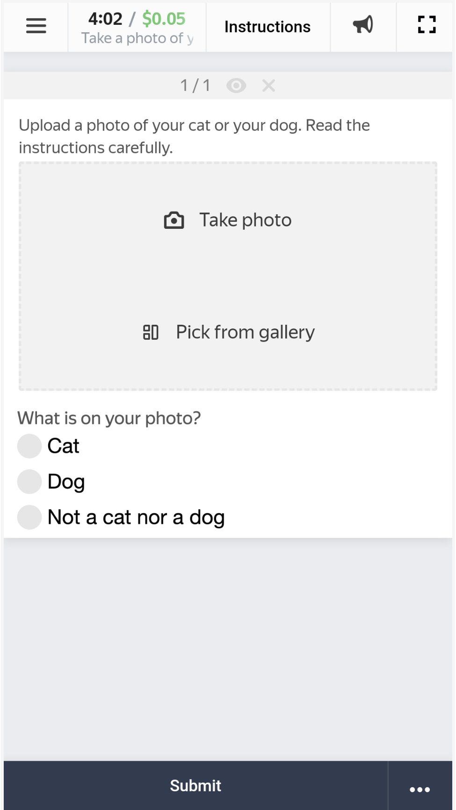

# How to collect images for a dataset

To run code below use [class ImageCollection](../src/main/java/ImageCollection.java).

The goal for this project is to collect images of dogs and cats for a dataset. This dataset will consist of images of dogs, cats, and empty images.

Performers will be asked to take a photo of their pet and specify the type of animal.

The real project like that should be subdivided into subprojects of validation and markup to make sure each photo is correct and contains the object it says it does. This example is simplified and doesn't contain subdivision.

To get acquainted with Toloka tools for free, you can use the promo code **TOLOKAKIT1** on $20 on your
[profile page](https://toloka.yandex.com/requester/profile?utm_source=github&utm_medium=site&utm_campaign=tolokakit)
after registration.

Сreate toloka-client factory instance. All api calls will go through it.

```java
var clientFactory = new TolokaClientFactoryImpl(DefaultHttpClientConfiguration.DEFAULT_TOLOKA_PROD_URI,
                                                "Your token here");
```

Switch `DefaultHttpClientConfiguration.DEFAULT_TOLOKA_PROD_URI` to `DefaultHttpClientConfiguration.DEFAULT_TOLOKA_SANDBOX_URI`
to use [Sandbox](https://toloka.ai/docs/guide/concepts/sandbox.html?lang=en).

## Create a new project

Define name and description of project.

```java
String name = "Take a photo of your pet";
String description = "If you have a cat or a dog, take a picture of it. If you don\\'t have any such animals, take a random photo.";
```

Prepare the task interface.

The task interface should:
- Contain the description of the task.
- Permit uploading images.
- Allow to select the type of object depicted in the image.

````java
String config = "{\n"
                + "    \"view\": {\n"
                + "        \"items\": [\n"
                + "            {\n"
                + "                \"data\": {\n"
                + "                    \"path\": \"image\",\n"
                + "                    \"type\": \"data.output\"\n"
                + "                },\n"
                + "                \"accept\": {\n"
                + "                    \"gallery\": true,\n"
                + "                    \"photo\": true\n"
                + "                },\n"
                + "                \"multiple\": false,\n"
                + "                \"label\": \"Upload a photo of your cat or dog. Read the instructions carefully.\",\n"
                + "                \"validation\": {\n"
                + "                    \"type\": \"condition.required\"\n"
                + "                },\n"
                + "                \"type\": \"field.media-file\"\n"
                + "            },\n"
                + "            {\n"
                + "                \"data\": {\n"
                + "                    \"path\": \"label\",\n"
                + "                    \"type\": \"data.output\"\n"
                + "                },\n"
                + "                \"options\": [\n"
                + "                    {\n"
                + "                        \"value\": \"cat\",\n"
                + "                        \"label\": \"Cat\"\n"
                + "                    },\n"
                + "                    {\n"
                + "                        \"value\": \"dog\",\n"
                + "                        \"label\": \"Dog\"\n"
                + "                    },\n"
                + "                    {\n"
                + "                        \"value\": \"none\",\n"
                + "                        \"label\": \"Not a cat nor a dog\"\n"
                + "                    }\n"
                + "                ],\n"
                + "                \"label\": \"What is in your photograph?\",\n"
                + "                \"validation\": {\n"
                + "                    \"type\": \"condition.required\"\n"
                + "                },\n"
                + "                \"type\": \"field.radio-group\"\n"
                + "            }\n"
                + "        ],\n"
                + "        \"type\": \"view.list\"\n"
                + "    }\n"
                + "}";
````

Set data specification. And set task interface to project.

````java
Map<String, FieldSpec> inputSpec = Map.of("label", new FieldSpec.StringSpec(true));
var labelSpec = new FieldSpec.StringSpec(true);
labelSpec.setAllowedValues(Set.of("cat", "dog", "none"));
Map<String, FieldSpec> outputSpec = Map.of("image", new FieldSpec.FileSpec(true),
                                            "label", labelSpec);
var viewSpec = new TbTaskViewSpec(Map.ofEntries(Map.entry("showSubmit", true),
                                                Map.entry("showFinish", true),
                                                Map.entry("showTimer", true),
                                                Map.entry("showReward", true),
                                                Map.entry("showTitle", true),
                                                Map.entry("showRoute", true),
                                                Map.entry("showComplain", true),
                                                Map.entry("showMessage", true),
                                                Map.entry("showSubmitExit", true),
                                                Map.entry("showFullscreen", true),
                                                Map.entry("showInstructions", true)));
viewSpec.setConfig(config);
var lock = Map.of("core", "1.0.0",
        "condition.required", "1.0.0",
        "field.media-file", "1.0.0",
        "field.radio-group", "1.0.0",
        "view.list", "1.0.0");
viewSpec.setLock(lock);
TaskSpec taskSpecification = new TaskSpec(inputSpec, outputSpec, viewSpec);
````
Write short and simple instructions.

````java
String instructions = "Take a picture of your pet if it is a cat or a dog and select the appropriate label type."
        + "<br><br>\n"
        + "If you do not have a cat or a dog, take a photo of anything and select a \"Not a cat nor a dog\" label. "
        + "There should be exactly one animal in the photo, clearly visible, not cropped. "
        + "The animal can be photographed from any side and in any position. "
        + "You can take a picture of a pet in your arms.<br><br>\n"
        + "It should be clearly visible what animal is depicted "
        + "(e.g. do not photograph your pet's back in the dark).";
````

Create a project.

````java
Project project = new Project(
        name,
        description,
        instructions,
        taskSpecification,
        AssignmentsIssuingType.AUTOMATED
);
var projectCreationResult = clientFactory.getProjectClient().createProject(project);
String projectId = projectCreationResult.getResult().getId();
````

Link to open in web interface: `https://toloka.yandex.com/requester/project/<project_id>`

## Pool creation

Create a task pool and set its quality control rules.

This project will only allow one answer. It can be implemented through a skill:

1. A performer gets the skill after sending a response.
2. The performers with the skill are not allowed to perform the task.

### Create skill:

````java
public Skill getSkill(String skillName) {
    var skillClient = clientFactory.getSkillClient();
    var skillSearchRequest = SkillSearchRequest.make().done();
    var findSkillsResult = skillClient.findSkills(skillSearchRequest);
    for (var skill: findSkillsResult.getItems()) {
        if (skill.getName().equals(skillName)) {
        return skill;
        }
    }
    var skill = new Skill(skillName);
    skill.setHidden(true);
    skill.setPublicRequesterDescription(Map.of(LangIso639.EN, "The performer took a photo of their pet."));
    var createSkillResult = skillClient.createSkill(skill);
    return createSkillResult.getResult();
}

Skill = getSkill("Pet photo")
````

###  Create pool:

````java
Pool pool = new Pool(projectId,
        "Pool 1",
        false,
        Date.from(Instant.now().plus(365, ChronoUnit.DAYS)),
        BigDecimal.valueOf(0.01),
        600,
        true,
        new PoolDefaults(1)
);
````

Access to tasks is granted for:

1. Toloka Mobile users.

   _Why: A phone is a convenient tool to make photos. A phone also makes it harder to cheat by uploading a random file._

2. English-speaking performers.

   _Why: The task instruction is written in English._

````java
pool.setFilter(new Connective.And(List.of(new Expression.Languages(ArrayInclusionOperator.IN, LangIso639.EN),
                new Expression.Skill(skill.getId(), CompareOperator.EQ, null),
                new Expression.DeviceCategory(IdentityOperator.EQ, DeviceCategory.SMARTPHONE))));
````

Set up the Submitted responses quality control rule. When a persons submit 1 or more tasks, they are assigned the skill created above.

````java
RuleConfig setSkillRuleConfig = new RuleConfig(
        List.of(new RuleCondition.AssignmentsAcceptedCount(CompareOperator.GTE, 0)),
        new RuleAction.SetSkill (
                new RuleAction.SetSkill.Parameters(
                        skill.getId(),
                        1)
        ));

var setSkillControlConfig = new QualityControlConfig(new CollectorConfig.AnswerCount(), List.of(setSkillRuleConfig));
QualityControl qualityControl = new QualityControl(List.of(setSkillControlConfig));
pool.setQualityControl(qualityControl);
````

Create a pool.

````java
var poolCreationResult = clientFactory.getPoolClient().createPool(pool);
String poolUd = poolCreationResult.getResult().getId();
````

Link to open in web interface: `https://toloka.yandex.com/requester/project/<project_id>/pool/<pool_id>`

Open the project for preview.

Mobile devices will display the task like that:



**Note:** In preview mode you won't be able to upload an image and look at the result.
This restriction is related to the preview features and doesn't affect performers.

### Add a task and run the project
Add one task.

Adjust the amount of images you want to get by changing the overlap.

````java
int imageCount = 5; // How many images you will receive.
var taskSuit = new TaskSuite(poolId, List.of(new BaseTask(Map.of("label", "Cats vs Dogs"))));
taskSuit.setOverlap(imageCount);
````

Add task suites to the pool:

````java
var taskSuitClient = clientFactory.getTaskSuiteClient();
taskSuitClient.createTaskSuite(taskSuit);
````

Start the pool.

**Important.** Remember that real Toloka performers will complete the tasks. Double check that everything is correct
with your project configuration before you start the pool.

````java
clientFactory.getPoolClient().openPool(poolId);
````

## Receiving responses

Wait until the pool is completed.

```java
Pool pool = clientFactory.getPoolClient().getPool(poolId);
while (pool.getStatus() != PoolStatus.CLOSED) {
    try {
        Thread.sleep(1000 * 60);
    } catch (InterruptedException ignored) {
    }
    pool = clientFactory.getPoolClient().getPool(poolId);
}
```

Download the results.

Note: You should download files' ids, not the files themselves. The files will only be needed right before reviewing.

````java
var assigmentClient = clientFactory.getAssignmentClient();
var assigmentSearchRequest = AssignmentSearchRequest.make()
        .filter().byStatus(AssignmentStatus.ACCEPTED).byPoolId(poolId)
        .and()
        .done();
var searchAssigmentResult = assigmentClient.findAssignments(assigmentSearchRequest);
Map<String, String> solutions = new HashMap<>();
for (var item : searchAssigmentResult.getItems()) {
    var outputValues = item.getSolutions().get(0).getOutputValues();
    solutions.put((String) outputValues.get("image"), (String) outputValues.get("label"));
}
````

`solutions` is a map, where for each element key is attachment id and value is its label.

## Showing results

Code below download one attachment with `attachmentId` into file `outputFile`. 
All attachment ids can be found in `solutions.keySet()`

````java
var attachmentClient = clientFactory.getAttachmentClient();
var attachmentDownload = attachmentClient.downloadAttachment(attachmentId);
byte [] data = attachmentDownload.getEntity().readAllBytes();
ByteArrayInputStream bis = new ByteArrayInputStream(data);
BufferedImage bufferedImage = ImageIO.read(bis);
ImageIO.write(bufferedImage, "jpg", new File(outputFile));
````

