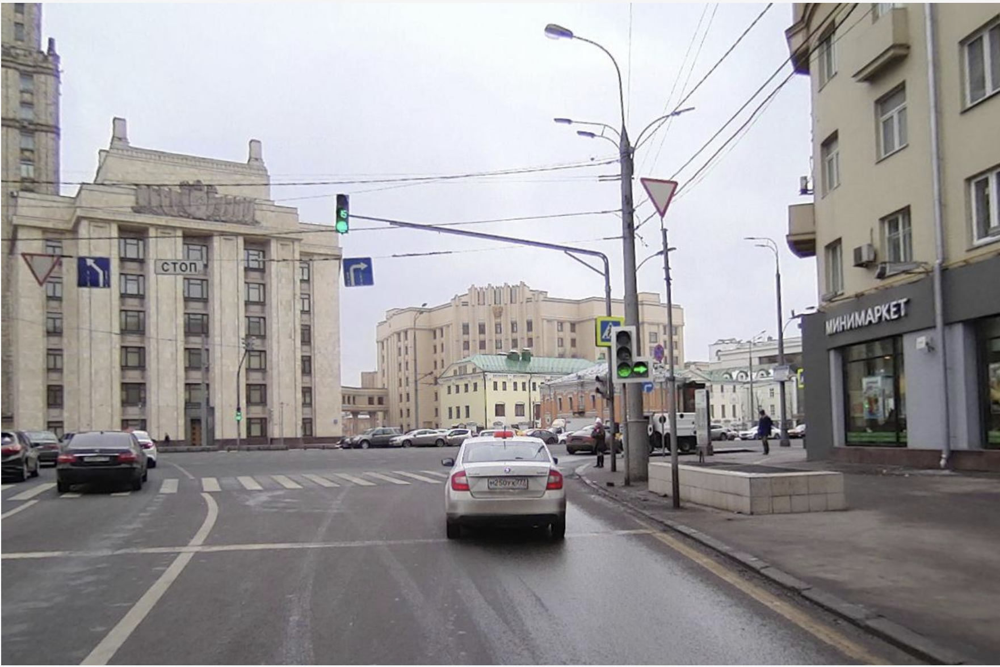
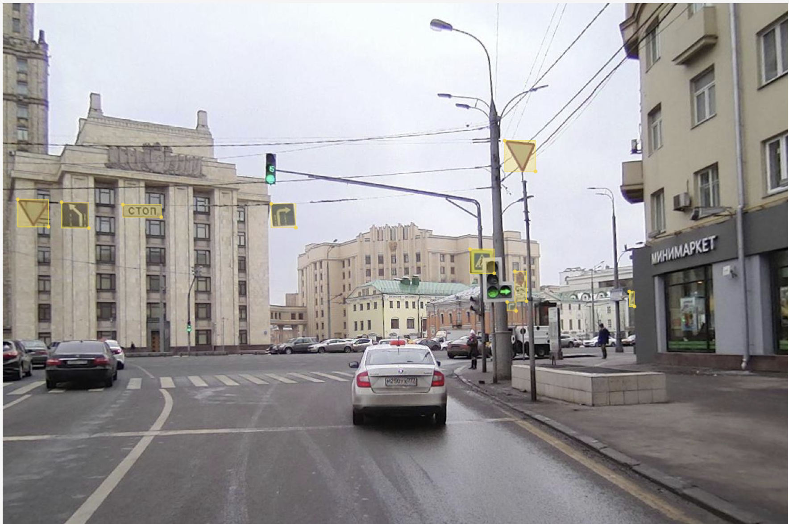
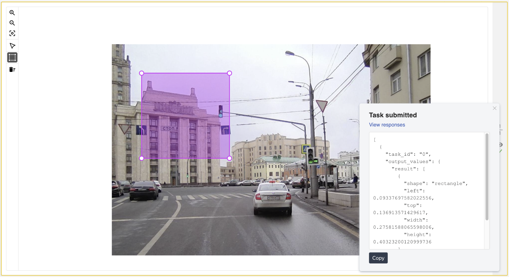

# Annotating ground truth for object detection

To run code below use [class ImageDetection](../src/main/java/ImageDetection.java).

The goal of this example is to annotate images which can later be used for training of detection algorithms.

We will configure and run such project in Toloka from scratch.

Performers will be asked to annotate the particular objects in the image.

To get acquainted with Toloka tools for free, you can use the promo code **TOLOKAKIT1** on $20 on your
[profile page](https://toloka.yandex.com/requester/profile?utm_source=github&utm_medium=site&utm_campaign=tolokakit)
after registration.

## The challenge
We have a set of real-life photos of roads:



We need to outline every traffic sign. Ultimately, we need to get a set of contours, defined by an array of points, that
represent the road signs in each photo. Here’s how it can look like:




In real-world tasks, annotation is usually done with a polygon. We chose to use a rectangular outline to simplify the
task so that we can reduce costs and speed things up.

### Detailed task description
In this notebook we will implement Projects 2 and 3 from the [tutorial](https://toloka.ai/docs/guide/concepts/image-segmentation-overview.html?utm_source=github&utm_medium=site&utm_campaign=tolokakit).
Check this link if you want to configure these projects right in the web interface.

We'll skip the first project "Does the image contain a specific object?" from tutorial above, since it's easy to
implement using our ["verification project"](https://toloka.ai/docs/guide/concepts/image-segmentation-project3.html?utm_source=github&utm_medium=site&utm_campaign=tolokakit) code.

Here are the two projects we’re going to implement:
- **Detection project** "[Select an object in the image](https://toloka.ai/docs/guide/concepts/image-segmentation-project2.html?utm_source=github&utm_medium=site&utm_campaign=tolokakit)" : performers will select image areas that contain a traffic sign.
- **Verification project** "[Are the bounding boxes correct?](https://toloka.ai/docs/guide/concepts/image-segmentation-project3.html?utm_source=github&utm_medium=site&utm_campaign=tolokakit)" : performers will determine if traffic signs were selected correctly in the images.

[Control tasks](https://toloka.ai/docs/guide/concepts/goldenset.html?utm_source=github&utm_medium=site&utm_campaign=tolokakit) and [majority vote](https://toloka.ai/docs/guide/concepts/mvote.html?utm_source=github&utm_medium=site&utm_campaign=tolokakit) aren't used for the detection project, because we can’t expect the area annotations provided by the performers to match each other exactly. Instead, we’ll check detection results in the second project, where a different group of performers will determine whether the traffic signs were annotated correctly or not.


Сreate toloka-client factory instance. All api calls will go through it.

```java
var clientFactory = new TolokaClientFactoryImpl(DefaultHttpClientConfiguration.DEFAULT_TOLOKA_PROD_URI,
                                                "Your token here");
```

Switch `DefaultHttpClientConfiguration.DEFAULT_TOLOKA_PROD_URI` to `DefaultHttpClientConfiguration.DEFAULT_TOLOKA_SANDBOX_URI`
to use [Sandbox](https://toloka.ai/docs/guide/concepts/sandbox.html?lang=en).

## Create a new detection project

In this project, performers select image areas that contain traffic signs.

The first step is to configure how performers will see the tasks:
* write instructions,
* define the input and output formats.

**Note:** It's important to write clear instructions with examples to make sure the performers do exactly what we want. We also recommend checking the task interface.

Define name and description of project.

```java
String name = "Outline all traffic signs with bounding boxes";
String description = "Find and outline all traffic signs with bounding boxes.";
```

Prepare the task interface.

```java
String config = "{\n"
                + "    \"view\": {\n"
                + "        \"data\": {\n"
                + "            \"path\": \"result\",\n"
                + "            \"type\": \"data.output\"\n"
                + "        },\n"
                + "        \"image\": {\n"
                + "            \"path\": \"image\",\n"
                + "            \"type\": \"data.input\"\n"
                + "        },\n"
                + "        \"shapes\": {\n"
                + "            \"rectangle\": true\n"
                + "        },\n"
                + "        \"validation\": {\n"
                + "            \"hint\": \"Please select an area\",\n"
                + "            \"type\": \"condition.required\"\n"
                + "        },\n"
                + "        \"type\": \"field.image-annotation\"\n"
                + "    }\n"
                + "}";
```

Set data specification. And set task interface to project.

````java
Map<String, FieldSpec> inputSpec = Map.of("image", new FieldSpec.UrlSpec(true));
Map<String, FieldSpec> outputSpec = Map.of("result", new FieldSpec.JsonSpec(true));
var viewSpec = new TbTaskViewSpec(Map.of());
viewSpec.setConfig(config);
var lock = Map.of("core", "1.0.0",
                    "condition.required", "1.0.0",
                    "field.image-annotation", "1.0.0");
viewSpec.setLock(lock);
TaskSpec taskSpecification = new TaskSpec(inputSpec, outputSpec, viewSpec);
````
Write short and simple instructions.

````java
String instructions = "<b>Outline each traffic sign with a separate bounding box(rectangle).</b>";
````

Create a project.

````java
Project project = new Project(
        name,
        description,
        instructions,
        taskSpecification,
        AssignmentsIssuingType.AUTOMATED
);
var projectCreationResult = clientFactory.getProjectClient().createProject(project);
String projectId = projectCreationResult.getResult().getId();
````

Link to open in web interface: `https://toloka.yandex.com/requester/project/<project_id>`

### Review your project and check the task interface

Visit the project page to make sure the task interface is working correctly.

To do this:

1. Follow the link in the output above.
2. In the project interface, click **Project actions** on the top right.
3. Click **Preview** in the menu that appears.
4. Click **Change input data**.
5. Insert an image URL (for example, `https://tlk.s3.yandex.net/sdc/photos/0b35956a9afc639a71045f09745096de.jpg`) into the `image` field.
6. Click the **Instructions** button. Make sure the instructions are shown and valid.
7. Try to select multiple areas with a rectangle using **Box annotation tool**.
8. Click **Submit** and then **View responses**.

The result window will appear. Check that your results are in the expected format and that the data is being entered correctly.



We strongly recommend to check the task interface and instructions every time you create a project. This helps performers to complete the task correctly and your results to be useful.

**Tip:** Do a trial run with a small amount of data. Make sure that after running the entire pipeline, you get data in the expected format and quality.

### Add custom skills for performers

A skill can describe any characteristic of the performer. Skills are defined by a number from 0 to 100. For example, you can record the percentage of correct responses as a skill. Learn more about [skills](https://toloka.ai/docs/guide/concepts/nav.html?utm_source=github&utm_medium=site&utm_campaign=tolokakit).

In this project, we'll create two skills:
- **Detection skill**: Shows the performer completed at least one detection task. We'll later filter out these performers from verification tasks, so that no one can check their own detection.
- **Verification skill**: How good the current performer is, when compared to others. We'll need this skill later when aggregating the results of the second project.


```java
public Skill getSkill(String skillName, String description) {
    var skillClient = clientFactory.getSkillClient();
    var skillSearchRequest = SkillSearchRequest.make().done();
    var findSkillsResult = skillClient.findSkills(skillSearchRequest);
    for (var skill : findSkillsResult.getItems()) {
        if (skill.getName().equals(skillName)) {
            return skill;
        }
    }
    var skill = new Skill(skillName);
    skill.setHidden(true);
    skill.setPublicRequesterDescription(Map.of(LangIso639.EN, description));
    var createSkillResult = skillClient.createSkill(skill);
    return createSkillResult.getResult();
}

var detectionSkill = getSkill("Area selection of road signs",
        "Performer is annotating road signs");

var verificationSkill = getSkill("Detection verification",
        "How good a performer is at verifying detection tasks");
```

### Pool creation for a detection project
A pool is a set of paid tasks sent out for performers.

First, create an instance of the pool and set the basic parameters:
- Payment amount per task.
- Non-automatic acceptance of results.
- Number of tasks performers will see on one page.
- Performer's filter: control who can access this task.

More about configuring and running pools in:
* [Toloka Kit](https://toloka.ai/docs/toloka-kit/source/toloka.client.pool.html?utm_source=github&utm_medium=site&utm_campaign=tolokakit)
* [Help](https://toloka.ai/docs/guide/concepts/pool-main.html?utm_source=github&utm_medium=site&utm_campaign=tolokakit)
* [Toloka API](https://toloka.ai/docs/api/create-pool.html?utm_source=github&utm_medium=site&utm_campaign=tolokakit)

````java
// We don't need overlapping for detection tasks, so we set it to 1
var poolDefaults = new PoolDefaults(1);
poolDefaults.setDefaultOverlapForNewTasks(1);
Pool pool = new Pool(projectId,
                poolName,
                false,  // Pool do not contains adult content
                Date.from(Instant.now().plus(365, ChronoUnit.DAYS)), // Pool will automatically close after one year
                BigDecimal.valueOf(0.01), // Set the minimum payment amount for one task page
                600, // Give performers 10 minutes maximum to complete one task page.
                true, // Do not auto accept solutions, Only pay the performer for completing the task,
                      // based on the verification results of the second project.
                poolDefaults
        );
pool.setAutoAcceptPeriodDay(7);  // Number of days to determine if we'll pay for task completion by this performer or not.
````

Set the number of tasks per page.
Please note that the payment amount specified when creating the pool is the amount the performer receives for completing one page of tasks.
If you specify 10 tasks per page above, then reward_per_assignment will be paid for completing 10 tasks.

````java
pool.setMixerConfig(new MixerConfig(
        1,  // real tasks count
        0,  // golden tasks count
        0   // training tasks count
        ));
mixerConfig.setForceLastAssignment(true);
pool.setMixerConfig(mixerConfig);
````

We'll only show our tasks to English-speaking users because the description of the task is in English.
This means that only people who speak English will be able to accept this task.

````java
pool.setFilter(new Connective.And(List.of(new Expression.Languages(ArrayInclusionOperator.IN, LangIso639.EN));
````

**Quality control rules**

View a detailed description of our quality control rules [in documentation](https://toloka.ai/docs/guide/concepts/control.html?utm_source=github&utm_medium=site&utm_campaign=tolokakit).

Each quality control rule consists of the following:
- **Collector**: How to collect statistics and which metrics can be used in this rule.
- **Condition**: When the rule will be triggered. Under this condition, only parameters that apply to the collector can be used.
- **Action**: What to do if the condition is true.

The first rule in this project restricts pool access for performers who often make mistakes.
If performer completed more than 2 tasks and more than 35% of their responses were rejected we'll restrict access for 15 days.

````java
RuleConfig acceptanceRateRuleConfig = new RuleConfig(
        List.of(new RuleCondition.TotalAssignmentsCount(CompareOperator.GT, 2),
        new RuleCondition.RejectedAssignmentsRate(CompareOperator.GT, 35.0)),
        new RuleAction.RestrictionV2(
                new RuleAction.RestrictionV2.Parameters(
                        UserRestrictionScope.ALL_PROJECTS,
                        15, DurationUnit.DAY,
                        "Performer often make mistakes")
        ));

QualityControl acceptanceRateQualityControl = new QualityControlConfig(
        new CollectorConfig.AcceptanceRate(),
        List.of(acceptanceRateRuleConfig));
````

The second useful rule is "Fast responses". It allows us to filter out performers who respond too quickly.
Let's monitor fast submissions for the last 5 completed task pages and define ones that take less than 20 seconds as quick responses.
If we see more than one fast response, we ban the performer from all our projects for 10 days.

````java
RuleConfig assignmentSubmitTimeRuleConfig = new RuleConfig(
        List.of(new RuleCondition.FastSubmittedCount(CompareOperator.GT, 1)),
        new RuleAction.RestrictionV2(
                new RuleAction.RestrictionV2.Parameters(
                        UserRestrictionScope.ALL_PROJECTS,
                        10, DurationUnit.DAY,
                        "Fast responses")
        ));

QualityControl assignmentSubmitQualityControl = new QualityControlConfig(
        new CollectorConfig.AssignmentSubmitTime(
                new CollectorConfig.AssignmentSubmitTime.Parameters(5, 20)),
        List.of(assignmentSubmitTimeRuleConfig));
````

Another rule we use is for automatically updating skills. 
We update the detection skill for performers who complete at least one page of tasks from detection pool.

````java
RuleConfig answerCountRuleConfig = new RuleConfig(
        List.of(new RuleCondition.AssignmentsAcceptedCount(CompareOperator.GT, 0)),
        new RuleAction.SetSkill(
                new RuleAction.SetSkill.Parameters(
                        detectionSkill.getId(),
                        1)
        ));
QualityControl answerCountQualityControl = new QualityControlConfig(new CollectorConfig.AnswerCount(), List.of(answerCountRuleConfig));
````
This rule sends rejected assignments (tasks that you rejected) to other performers according to specified parameters.
If a task was rejected and 1 to overlap then open the pool.

````java
RuleConfig assignmentsAssessmentRuleConfig = new RuleConfig(
        List.of(new RuleCondition.AssessmentEvent(IdentityOperator.EQ,
                        RuleCondition.AssessmentEvent.Type.REJECT)),
        new RuleAction.ChangeOverlap(
                new RuleAction.ChangeOverlap.Parameters(
                        1,
                        true
                )
        ));
QualityControl answerCountQualityControl = new QualityControlConfig(new CollectorConfig.AssignmentsAssessment(),
                List.of(assignmentsAssessmentRuleConfig));
````

Set rules.

````java
QualityControl qualityControl = new QualityControl(List.of(
                acceptanceRateControlConfig,
                assignmentSubmitTimeControlConfig,
                answerCountControlConfig,
                assignmentsAssessmentControlConfig));
pool.setQualityControl(qualityControl);
````

### Create a pool with all specified conditions

Now we call the Toloka API to finally create a pool in the detection project.

Afterwards, you can check the pool in the web interface. You'll see there aren't any tasks in it. We'll add them later.

````java
var poolCreationResult = clientFactory.getPoolClient().createPool(pool);
String poolId = poolCreationResult.getResult().getId();
````

Link to open in web interface: `https://toloka.yandex.com/requester/project/<project_id>/pool/<pool_id>`


## Add tasks to detection pool

### Download dataset
Our dataset is just a collection of image URLs.

````bash
!curl https://tlk.s3.yandex.net/dataset/road_signs.tsv --output dataset.tsv
````

### Upload tasks

````java
List<String> dataset;
try {
    dataset = readTsv("dataset.tsv");
} catch (IOException e) {
    e.getMessage();
    return;
}
var taskDataset = dataset.subList(0, 20);

var tasks = taskDataset.stream().map(url -> {
    var task = new Task(poolId, Map.of("image", url));
    task.setOverlap(1);
    return task;
}).collect(Collectors.toUnmodifiableList());

var taskCreateRequestParameters = new TaskCreateRequestParameters();
clientFactory.getTaskClient().createTasks(tasks, taskCreateRequestParameters);
````

Method `readTsv` makes list of URLs from tsv file.

````java
private static List<String> readTsv(String file) throws IOException {
    String content = Files.readString(Path.of(file), StandardCharsets.US_ASCII);
    List<String> rows = new ArrayList<>(List.of(content.split("\n")));
    rows.remove(0);
    return rows;
}
````


## Create a new project for verification
In this project, performers will determine if traffic signs were outlined correctly or not.

This will be a standard classification project with only two classes: `OK` and `BAD`. We’ll explicitly define these labels as the output values.

Define name and description of project.

```java
String name = "Are the traffic signs outlined correctly?";
String description = "Look at the image and decide whether or not the traffic signs are outlined correctly";
```

Prepare the task interface.

```java
String config = "{\n"
        + "    \"view\": {\n"
        + "        \"items\": [\n"
        + "            {\n"
        + "                \"data\": {\n"
        + "                    \"path\": \"selection\",\n"
        + "                    \"default\": {\n"
        + "                        \"path\": \"selection\",\n"
        + "                        \"type\": \"data.input\"\n"
        + "                    },\n"
        + "                    \"type\": \"data.internal\"\n"
        + "                },\n"
        + "                \"image\": {\n"
        + "                    \"path\": \"image\",\n"
        + "                    \"type\": \"data.input\"\n"
        + "                },\n"
        + "                \"disabled\": true,\n"
        + "                \"type\": \"field.image-annotation\"\n"
        + "            },\n"
        + "            {\n"
        + "                \"data\": {\n"
        + "                    \"path\": \"result\",\n"
        + "                    \"type\": \"data.output\"\n"
        + "                },\n"
        + "                \"options\": [\n"
        + "                    {\n"
        + "                        \"value\": \"OK\",\n"
        + "                        \"label\": \"Yes\"\n"
        + "                    },\n"
        + "                    {\n"
        + "                        \"value\": \"BAD\",\n"
        + "                        \"label\": \"No\"\n"
        + "                    }\n"
        + "                ],\n"
        + "                \"label\": \"Are all traffic signs outlined correctly?\",\n"
        + "                \"validation\": {\n"
        + "                    \"type\": \"condition.required\"\n"
        + "                },\n"
        + "                \"type\": \"field.radio-group\"\n"
        + "            }\n"
        + "        ],\n"
        + "        \"type\": \"view.list\"\n"
        + "    },\n"
        + "    \"plugins\": [\n"
        + "        {\n"
        + "            \"1\": {\n"
        + "                \"data\": {\n"
        + "                    \"path\": \"result\",\n"
        + "                    \"type\": \"data.output\"\n"
        + "                },\n"
        + "                \"payload\": \"OK\",\n"
        + "                \"type\": \"action.set\"\n"
        + "            },\n"
        + "            \"2\": {\n"
        + "                \"data\": {\n"
        + "                    \"path\": \"result\",\n"
        + "                    \"type\": \"data.output\"\n"
        + "                },\n"
        + "                \"payload\": \"BAD\",\n"
        + "                \"type\": \"action.set\"\n"
        + "            },\n"
        + "            \"type\": \"plugin.hotkeys\"\n"
        + "        }\n"
        + "    ]\n"
        + "}";
```

Set data specification. And set task interface to project.

````java
Map<String, FieldSpec> inputSpec = Map.of("image", new FieldSpec.UrlSpec(true),
                                        "selection", new FieldSpec.JsonSpec(true),
                                        "assignment_id", new FieldSpec.StringSpec(true));
var stringSpec = new FieldSpec.StringSpec(true);
stringSpec.setAllowedValues(Set.of("OK", "BAD"));
Map<String, FieldSpec> outputSpec = Map.of("result", stringSpec);
var viewSpec = new TbTaskViewSpec(Map.of());
viewSpec.setConfig(config);
var lock = Map.of("core", "1.0.0",
        "field.image-annotation", "1.0.0",
        "condition.required", "1.0.0",
        "field.radio-group", "1.0.0",
        "view.list", "1.0.0",
        "action.set", "1.0.0",
        "plugin.hotkeys", "1.0.0");
viewSpec.setLock(lock);
TaskSpec taskSpecification = new TaskSpec(inputSpec, outputSpec, viewSpec);
````
Write short and simple instructions.

````java
String instructions = "'<b>Look at the image and answer the question:</b><br/>\n"
        + "Are all traffic signs outlined correctly?<br/>\n"
        + "If they are, click Yes.<br/>\n"
        + "If they aren't, click No.<br/>\n"
        + "For example, the road signs here are outlined correctly, so the correct answer is Yes.";
````

Create a project.

````java
Project project = new Project(
        name,
        description,
        instructions,
        taskSpecification,
        AssignmentsIssuingType.AUTOMATED
);
var projectCreationResult = clientFactory.getProjectClient().createProject(project);
String verificationProjectId = projectCreationResult.getResult().getId();
````

Examine created project in the web interface. To do that:

1. Follow the link above to check the task interface and instructions.

   **Note:** You should see nearly the same interface as in the previous project, only without the ability to select areas.
   It's important to make sure that the annotation results from the first project display correctly in the second one.


2. Open the task **Preview** in the first project.
3. Outline the signs and click **Submit**.
4. Copy the result.
5. Now open the **Preview** of the second project.
6. Click **Change input data** and paste the annotation results in the `selection` field.
7. Click **Apply** and make sure the annotation displays correctly.


### Create and set up a pool in the verification project
We will add filter for this pool: specify performers that don't have the detection skill (as they performed in detection tasks). You can combine multiple conditions using the `&` and `|` operators.

**Note:** we add two quality control rules with the same collector, but with different conditions and actions.

````java
Pool verificationPool = new Pool(verificationProjectId,
        "Pool 1. Road sign verification",
        false,                                                // Pool do not contains adult content
        Date.from(Instant.now().plus(365, ChronoUnit.DAYS)),  // Pool will automatically close after one year
        BigDecimal.valueOf(0.01),                             // Set the minimum payment amount for one task page
        600,                                                  // Give performers 10 minutes maximum to complete one task page.
        true,                                                 // Auto accept solutions
        new PoolDefaults(5)                                   // We need an overlap to compare the performers among themselves,
        );
````

Set the task count for one page

````java
var mixerConfig = new MixerConfig(
            10,  // real tasks count
            0,   // golden tasks count
            0    // training tasks count
        );
mixerConfig.setForceLastAssignment(true);pool.setMixerConfig(mixerConfig);
````

We'll only show our tasks to English-speaking users because the description of the task is in English. 
We also won't allow our verification tasks to be performed by users who performed detection tasks.

````java
verificationPool.setFilter(new Connective.And(List.of(new Expression.Languages(ArrayInclusionOperator.IN, LangIso639.EN),
                new Expression.Skill(detectionSkill.getId(), CompareOperator.EQ, null))));
````

Set up quality control.

Quality is based on the majority of matching responses from performers who completed the same task.
If a performer has 10 or more responses and the responses are correct in less than 50% of cases we ban the performer from all our projects for 10 days.

````java
RuleConfig majorityVoteRuleConfig = new RuleConfig(
                List.of(
                        new RuleCondition.TotalAnswersCount(CompareOperator.GT, 9),
                        new RuleCondition.CorrectAnswersRate(CompareOperator.LT, 50.0)
                ),
                new RuleAction.RestrictionV2(
                        new RuleAction.RestrictionV2.Parameters(
                                UserRestrictionScope.ALL_PROJECTS,
                                10, DurationUnit.DAY,
                                "Doesn't match the majority")
                ));

var majorityVoteParameters = new CollectorConfig.MajorityVote.Parameters(2);
QualityControl majorityVoteQualityControl = new QualityControlConfig(
                new CollectorConfig.MajorityVote(majorityVoteParameters),
                List.of(majorityVoteRuleConfig)
        );
````

Set up the new skill value using MajorityVote. Depending on the percentage of correct responses, we increase the value of the performer's skill.

````java
RuleConfig SetSkillRuleConfig = new RuleConfig(
            List.of(new RuleCondition.TotalAnswersCount(CompareOperator.GT, 2)),
                new RuleAction.SetSkillFromOutputField(
                    new RuleAction.SetSkillFromOutputField.Parameters(
                        verificationSkill.getId(),
                        RuleConditionKey.CORRECT_ANSWERS_RATE
                    )
            ));

var majorityVoteParameters = new CollectorConfig.MajorityVote.Parameters(2);
majorityVoteParameters.setHistorySize(10);
QualityControl setSkillQualityControl new QualityControlConfig(
        new CollectorConfig.MajorityVote(majorityVoteParameters),
        List.of(SetSkillRuleConfig)
        );
````

Set rules.

````java
QualityControl qualityControl = new QualityControl(List.of(
                majorityVoteControlConfig,
                setSkillControlConfig));
verificationPool.setQualityControl(qualityControl);
````

## Wait for results

After getting answers on detection tasks we need to validate them. If some assignments are rejected, detection pool 
will be open and then new assignments will need validation again. 

We will get assignments from detection pool and validate them in verification pool until assignments on all tasks are accepted.

### Wait pool to be completed

````java
private void waitToComplete(String poolId) {
    Pool pool = clientFactory.getPoolClient().getPool(poolId);
    while (pool.getStatus() != PoolStatus.CLOSED) {
        try {
            Thread.sleep(1000 * 60);
        } catch (InterruptedException ignored) {
            // ignore
        }
        pool = clientFactory.getPoolClient().getPool(poolId);
    }
}
````

### Upload tasks for verification project

We take images and answers from detection pool and then make from each of them task for verification pool. 
Performers need to choose are all traffic signs outlined correctly. We set overlap to 5 because we want at least 5 answers on each task.

````java
public void uploadTasksForVerification(String poolId, String verificationPoolId) {
    var assignmentSearchRequest = AssignmentSearchRequest.make()
                .filter().byStatus(AssignmentStatus.SUBMITTED).byPoolId(poolId)
                .and()
                .done();

    var assignmentClient = clientFactory.getAssignmentClient();
    var assignmentSearchResult = assignmentClient.findAssignments(assignmentSearchRequest);

    var tasks = assignmentSearchResult.getItems().stream().map(assignment -> {
            var task = new Task(
                    verificationPoolId,
                    Map.of("image", assignment.getTasks().get(0).getInputValues().get("image"),
                            "selection", assignment.getSolutions().get(0).getOutputValues().get("result"),
                            "assignment_id", assignment.getId())
            );
            task.setOverlap(5);
            return task;
    }).collect(Collectors.toUnmodifiableList());

    var taskCreateRequestParameters = new TaskCreateRequestParameters();
    clientFactory.getTaskClient().createTasks(tasks, taskCreateRequestParameters);
}
````

### Aggregate results of verification pool

Results are aggregated by verification skill.

````java
public String aggregateSolutions(String poolId) {
    var verificationSkill = getSkill("Detection verification",
                "How good a performer is at verifying detection tasks");
    var aggregateSolutionsRequest = new WeightedDynamicOverlapPoolAggregatedSolutionRequest(poolId,
                verificationSkill.getId(),
                List.of(new WeightedDynamicOverlapPoolAggregatedSolutionRequest.Field("result")));

    var aggregatedSolutionOperation = clientFactory.getAggregatedSolutionClient()
                .aggregateSolutionsByPool(aggregateSolutionsRequest);

    while (!aggregatedSolutionOperation.isCompleted()) {
            try {
                aggregatedSolutionOperation = aggregatedSolutionOperation.waitToComplete();
            } catch (InterruptedException ignored) {
                // ignore
            }
    }
    return aggregatedSolutionOperation.getId();
}
````

### Get verifications results

We take aggregated solution from verification pool and if the result is `OK` accept assignment from detection pool or reject it 
if the result is `BAD`

Returns `true` if all assignments with status `sunmited` were accepted

````java
public boolean getVerificationResults(String operationId) {
    var solutionSearchRequest = AggregatedSolutionSearchRequest.make().limit(250).done();
    var aggregatedSolutionSearchResult = clientFactory.getAggregatedSolutionClient()
                .findAggregatedSolutions(operationId, solutionSearchRequest);

    var taskClient = clientFactory.getTaskClient();
    var assignmentClient = clientFactory.getAssignmentClient();
    boolean wasReject = false;
    for (var solution : aggregatedSolutionSearchResult.getItems()) {
        String assignmentId = (String) taskClient.getTask(solution.getTaskId())
                                                     .getInputValues().get("assignment_id");
        var assignment = assignmentClient.getAssignment(assignmentId);
        if (assignment.getStatus() != AssignmentStatus.SUBMITTED) {
            continue;                                               // skip assignment if it is already accepted or rejected
        }
        if (solution.getOutputValues().get("result").equals("OK")) {
            assignmentClient.acceptAssignment(assignmentId, "Well done!");
        } else {
            wasReject = true;
            assignmentClient.rejectAssignment(assignmentId,
                        "The object wasn't selected or was selected incorrectly.");
        }
    }
    return !wasReject;
    }
````

### Validate new submitted assignments

````java
private boolean validate(String poolId, String verificationProjectId) {
    uploadTasksForVerification(poolId, verificationPoolId);
    startPool(verificationPoolId);
    waitToComplete(verificationPoolId);
    String operationId = aggregateSolutions(verificationPoolId);
    return getVerificationResults(operationId);
}
````

### Wait for all responses

````java
public void waitForAllResponses(String poolId) {
    String verificationProjectId = createNewVerificationProject();
    String verificationPoolId = createVerificationPool(verificationProjectId,
        "Pool 1. Road sign verification");
    while (true) {
        waitToComplete(poolId);
        if (validate(poolId, verificationPoolId)) {
            break;
        }
    }
}
````

## Get the results
Now we can download all the accepted tasks from the detection pool and work with them. In this notebook, we'll only show the detection results.
You can also [download](https://toloka.ai/docs/guide/concepts/result-of-eval.html?utm_source=github&utm_medium=site&utm_campaign=tolokakit) results as a TSV file from web interface.

````java
var assignmentSearchRequest = AssignmentSearchRequest.make()
                .filter().byStatus(AssignmentStatus.ACCEPTED).byPoolId(poolId)
                .and()
                .done();

var assignmentClient = clientFactory.getAssignmentClient();
var assignmentSearchResult = assignmentClient.findAssignments(assignmentSearchRequest);
int resultNumber = 0;
for (var item : assignmentSearchResult.getItems()) {
    saveResult((String) item.getTasks().get(0).getInputValues().get("image"),
        item.getSolutions().get(0).getOutputValues(),
        "examples/src/main/resources/result" + resultNumber);
    resultNumber++;
````

Function `saveResult` load image from url and show selected parts on them.

````java
private void saveResult(String imgUrl, Map<String, Object> outputValues, String fileToSave) {
    BufferedImage img;
    try {
        URL url = new URL(imgUrl);
        img = ImageIO.read(url);
    } catch (IOException e) {
        e.printStackTrace();
        return;
    }

    int imgHeight = img.getHeight();
    int imgWidth = img.getWidth();
    Graphics2D graph = img.createGraphics();
    graph.setColor(Color.RED);

    List<Map<String, Object>> selections = (List<Map<String, Object>>) outputValues.get("result");
    for (var selection : selections) {
        if (selection.get("shape") == null || !selection.get("shape").equals("rectangle")) {
            continue;
        }
        double x = (Double) selection.get("left") * imgWidth;
        double y = (Double) selection.get("top") * imgHeight;
        double selectionWidth = (Double) selection.get("width") * imgWidth;
        double selectionHeight = (Double) selection.get("height") * imgHeight;
        graph.draw(new Rectangle((int) x, (int) y, (int) selectionWidth, (int) selectionHeight));
    }

    try {
        ImageIO.write(img, "jpg",
        new File(fileToSave + ".jpg"));
    } catch (IOException e) {
        e.printStackTrace();
    }
}
````
